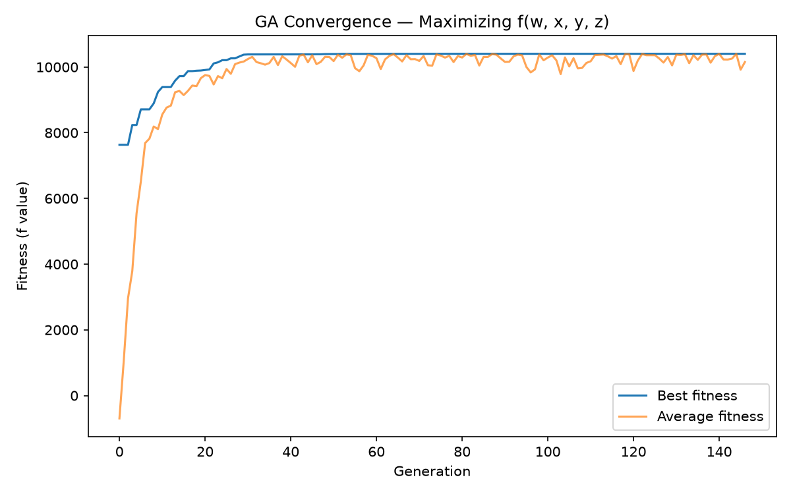

# Lab 1 — Maximizing f(w, x, y, z) with a Genetic Algorithm

## Problem

Maximize:

```
f(w, x, y, z) = w³ + x² – y² – z² + 2yz – 3wx + wz – xy + 2
```

over the bounded domain **w, x, y, z ∈ [-20, 20]**.

The domain has to be bounded because the `w³` term makes `f` unbounded above over the reals — without a box constraint, "maximize" has no finite answer.

## Running it

```bash
uv run python main.py
```

Prints the best `(w, x, y, z)` and `f` value found, and saves a convergence plot to `convergence.png` (best and average fitness per generation).

## Result

The GA reliably converges to the corner of the search box, `w=20, x=-20, y=20, z=20`, giving `f = 10402`. Over a bounded box, a function like this (dominated by the cubic and cross terms) attains its maximum at a vertex rather than an interior point.


