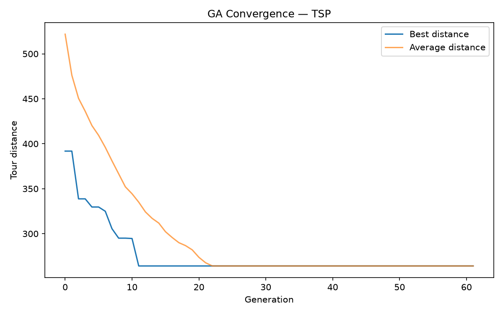
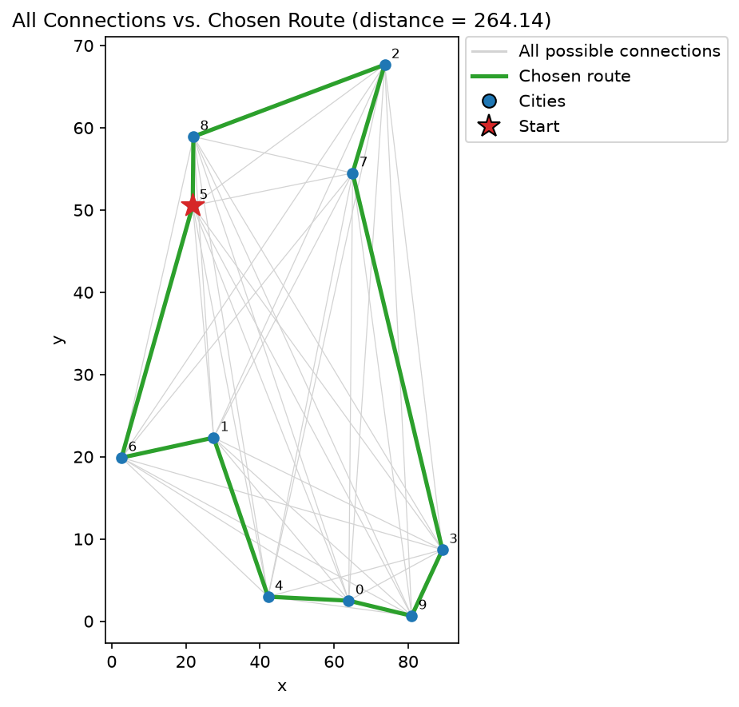

# Lab 2 — Travelling Salesman Problem with a Genetic Algorithm

## Problem

10 cities are placed at random 2D coordinates (seed 42, in a 100×100 box). Find the shortest **closed tour** that visits every city exactly once and returns to the start.

## Running it

```bash
uv run python main.py
```

Prints the number of generations run, the best distance found, and the best tour (as a sequence of city indices). Saves two plots:

- `convergence.png` — best and average tour distance per generation.
- `best_route.png` — all cities plotted in 2D with every possible city-to-city connection drawn faintly in the background (the complete graph the GA is searching over), the chosen route highlighted in bold green on top, and the start city marked with a red star.

```bash
uv run python compare_mutations.py
```

Re-runs the GA once per mutation operator on the same cities/seed and prints the comparison table above.

## Result

The GA converges to the optimal tour, length 264.14, for this 10-city instance. `best_route.png` gives a direct visual sanity check against the full graph in the background: the chosen route (green) touches every city exactly once, uses only a small fraction of all possible connections (gray), and closes back to its starting point with no skipped or duplicated cities.




