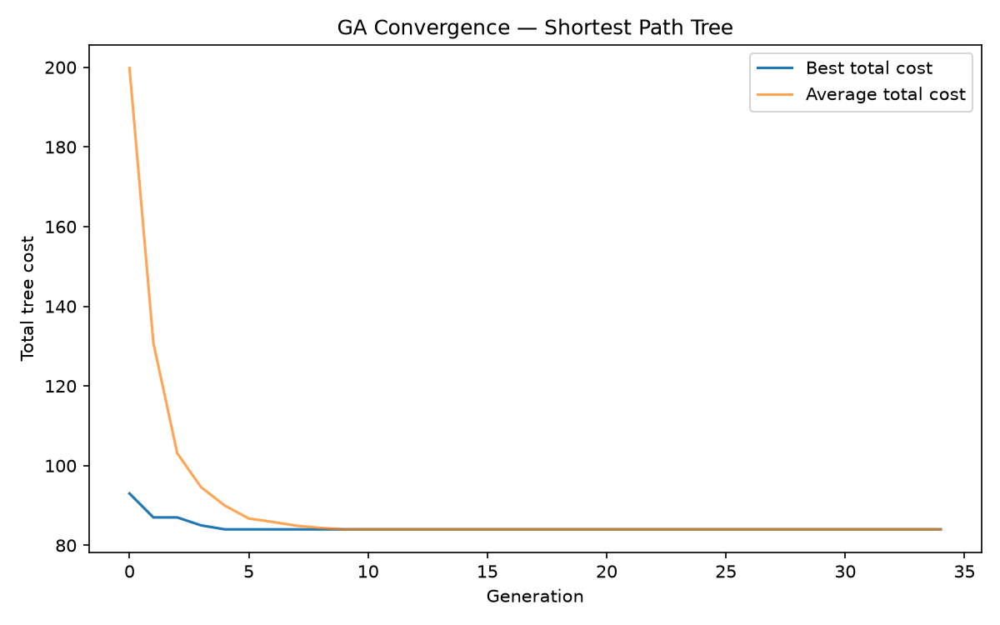
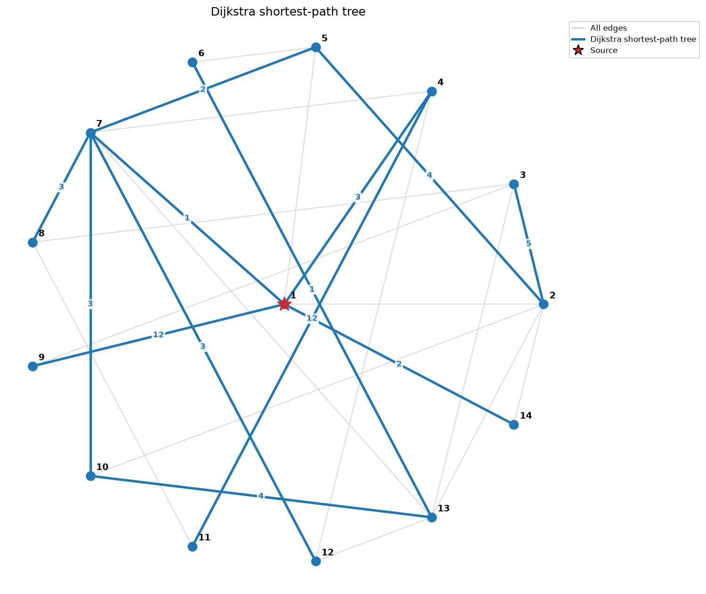
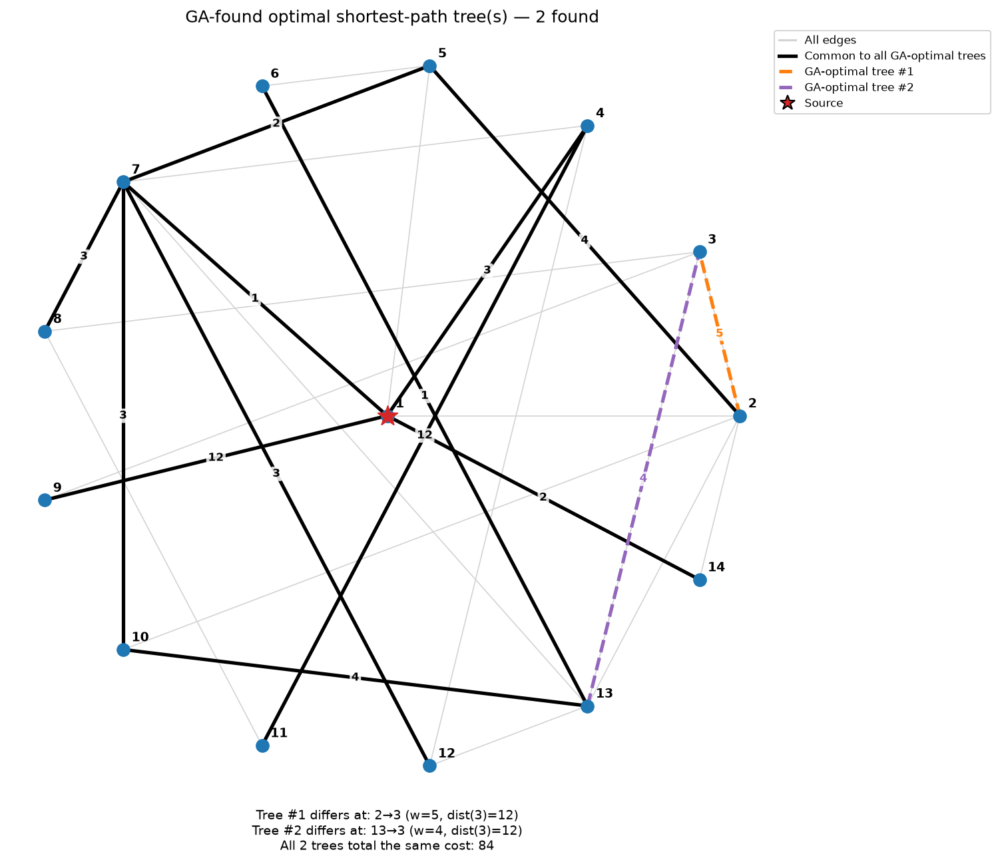

# Lab 4 — Shortest Path Problem: Dijkstra vs. a Genetic Algorithm

## Problem

Given a weighted graph and a source vertex, find the shortest path from the
source to every other vertex. Two solutions are implemented and compared on
the same demo graph.

1. **Dijkstra's algorithm** — the classical exact baseline.
2. **A genetic algorithm**

## Result

On this 14-node demo graph, the GA converges to the exact Dijkstra optimum on
every vertex (0% gap, total cost 84).

The final population also settled on **2 distinct optimal trees** — visible
in `ga_trees.png` as the black common backbone plus two dashed alternative
routes to vertex 3: via `2→3` (weight 5, with `dist(2) = 7`) and via
`13→3` (weight 4, with `dist(13) = 8`), both landing on exactly the same
total distance, `7 + 5 = 8 + 4 = 12`. Dijkstra only ever reports one
canonical choice per vertex; the GA's population-based search naturally
keeps tied alternatives alive side by side.

